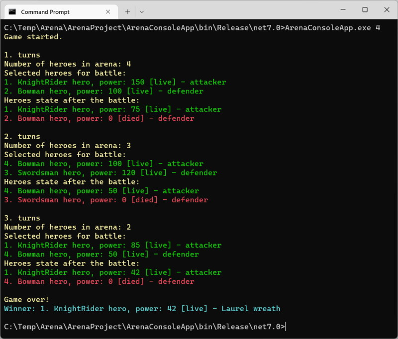

# Arena    

  

Arena is a simple Turn-based 1v1 battle simulator.

### Specification
There are many heroes in the arena like bowman, knight rider and swordsman. Every hero have an id, power and can attack and defense according to rules:

Bowman (attack)
<ul>
    <li>knight rider (defense): dies 40%, lives 60%</li>
    <li>swordsman (defense): dies</li>
    <li>bowman (defense): dies</li>
</ul>

Swordsman (attack)
<ul>
    <li>knight rider (defense): nothing happens </li>
    <li>swordsman (defense): dies</li>
    <li>bowman (defense): dies</li>
</ul>

Knight rider (attack)
<ul>
    <li>knight rider (defense): dies</li>
    <li>swordsman (defense): knight rider dies</li>
    <li>bowman (defense): dies</li>
</ul>

The game is divided into turns. An attacker and a defender are selected randomly for every turns. The other heroes rest and their power increase by 10. Their power can't increase above maximum. 

The power of the heroes decrease half. The power is less than quarter of the initial/maximum power then hero die. 

Initial and maximum power:
<ul>
    <li>knight rider: 150</li>
    <li>swordsman: 120</li>
    <li>bowman: 100</li>
</ul>

Before first turns generate heroes randomly. The random number is a parameter for game. 
The game lasts until a maximum of one hero remains. After turns write log with heroes properties. Create this game as a console application.
